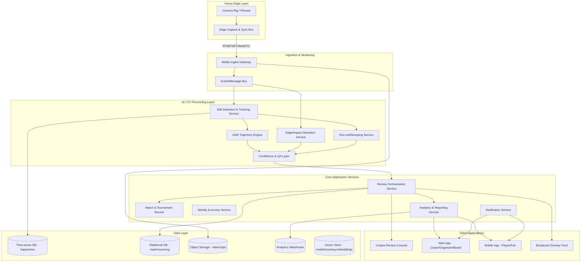
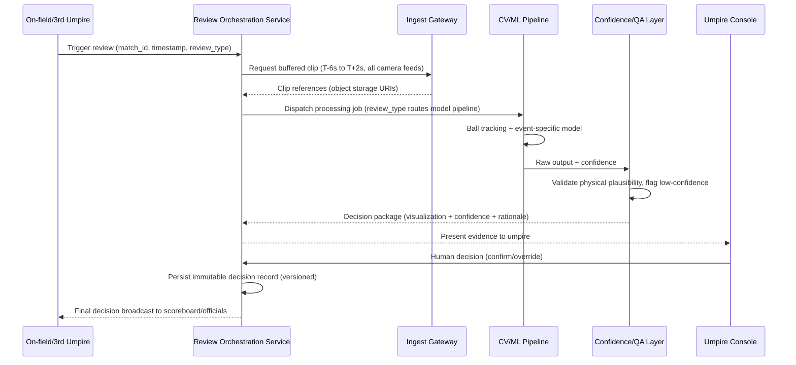
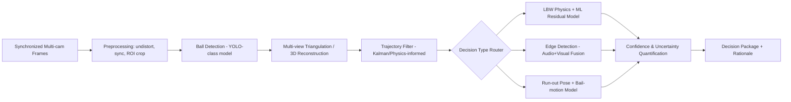

# Architecture Document
## AI-Powered Cricket Decision Review System (Cricket DRS)

**Status:** Draft v1.1 — updated post CTO review
**Companion to:** `prd.md`, `rules.md`

**Changelog (v1.0 → v1.1):** resolves the accessible-tier connectivity-vs-latency contradiction via a
local-inference fallback (Section 9a), adds a tier-capability matrix (Section 1a), specifies the
decision-record integrity mechanism, secrets management, partner-integration boundary, API rate
limiting, and a directional GPU/infrastructure cost model (Section 19). See the CTO review for full
rationale.

---

## 1. Architectural Principles

1. **Two-tier, one-platform:** accessible tier (1–2 cameras, cloud/edge hybrid) and broadcast tier (multi-camera, low-latency edge-first) share the same core services, data model, and ML model registry. Tier is a deployment/config concern, not a fork.
2. **Human-in-the-loop by design:** every AI decision path terminates in a human confirmation step for live matches. The architecture must make "show evidence, don't just show an answer" a first-class capability, not an afterthought.
3. **Real-time where it matters, batch everywhere else:** only the ball-tracking/event-detection pipeline needs hard real-time-ish latency during a live review. Analytics, highlights, and reporting are asynchronous.
4. **Explainability and auditability as data-model requirements**, not logging afterthoughts — every decision is a versioned, replayable artifact.
5. **Cloud-agnostic core, edge-capable at the boundary:** camera ingestion and initial frame processing must be able to run at the venue (poor/variable connectivity in club cricket), while heavier ML inference and all storage/analytics live centrally.
6. **Degrade gracefully to local, not just fail to cloud (new — CTO review):** the accessible tier's target venues are, by definition, exactly the venues most likely to have weak or inconsistent connectivity (`prd.md` Section 3). The architecture must not silently assume good uplink bandwidth — it must define a real local-inference fallback path (Section 9a) rather than let the latency SLA quietly fail at the venues that need the product most.

### 1a. Tier-Capability Matrix (new — CTO review)

Rather than letting accessible/broadcast behavioral differences leak implicitly into individual service
implementations, they are defined explicitly here as a living reference every service must consult:

| Capability | Accessible Tier | Broadcast Tier |
|---|---|---|
| Camera count | 2–4 (revised — hardware model update) | 6+ |
| Camera hardware (revised — hardware model update) | Platform-provided GoPro-class kit (120fps+), USB-C tethered to edge box | Dedicated broadcast rig, hardware genlock |
| Camera sync method | Software/audio-fingerprint sync | Hardware genlock |
| 3D reconstruction | Monocular-assisted depth estimation | Multi-view triangulation |
| Frame rate | 120fps+ (GoPro-class, revised — hardware model update; was 30–60fps under the earlier bring-your-own-phone assumption) | ≥100fps |
| Inference location | Cloud, **with local-inference fallback** below a defined bandwidth threshold (Section 9a) | Cloud/venue-adjacent, dedicated capacity |
| Latency SLA | ≤ 90s (cloud path) / ≤ 3min (local-fallback path) | ≤ 30s |
| Accuracy target | Provisional pending Phase 0 validation (`prd.md` Section 11) | ≥ 98% agreement (established benchmark) |
| Calibration | Ad-hoc, pitch-geometry-reference-assisted | Fixed-rig, pre-certified per venue |

Every new service or model configuration decision must state which row(s) of this matrix it affects,
and this table is updated in the same PR as any change to tier-specific behavior.

---

## 2. High-Level System Architecture

---

## 3. Application Flow (Review Lifecycle)

---

## 4. Data Flow

1. **Capture:** Cameras (fixed rig or phones) stream continuously to an on-venue edge box, which maintains a rolling buffer (e.g., last 20–30 seconds per camera) to avoid re-requesting footage from source devices.
2. **Ingest:** On review trigger, the edge box pushes the relevant buffered window to the cloud ingest gateway over SRT/WebRTC (resilient to variable club-venue connectivity) or RTMP where infrastructure allows.
3. **Processing:** The CV/ML pipeline consumes synchronized frames, produces tracked ball positions (time-series), event classifications, and model confidence.
4. **Decisioning:** Review Orchestration Service assembles a "decision package" (visual trajectory render, confidence score, rationale text, raw evidence links) and pushes it to the umpire console in near real time.
5. **Persistence:** Final human-confirmed decision, plus full AI evidence trail and model version, is written immutably to the relational store and object storage (video clips retained per retention policy).
6. **Downstream:** Analytics service asynchronously ingests completed match data into the warehouse for reporting, scouting, and dashboarding. Broadcast overlay and notification services subscribe to decision events via the message bus.

---

## 5. Major Components / Services

| Service | Responsibility |
|---|---|
| Media Ingest Gateway | Accepts venue video streams, buffers, time-synchronizes multi-camera feeds |
| Ball Detection & Tracking Service | Frame-level ball detection + trajectory reconstruction |
| Edge/Impact Detection Service | Audio+visual fusion for bat-ball contact detection |
| LBW Trajectory Engine | Physics + ML hybrid model projecting ball path through impact to stumps |
| Run-out/Stumping Service | Frame-accurate analysis of bail dislodgement vs. bat/foot position |
| Confidence & QA Layer | Uncertainty quantification, plausibility checks, human-review flagging |
| Review Orchestration Service | Coordinates the end-to-end review workflow and state machine |
| Match & Tournament Service | Match setup, playing conditions, review-quota enforcement |
| Identity & Access Service | Multi-tenant auth, RBAC across personas |
| Analytics & Reporting Service | Post-match, season, and scouting analytics |
| Notification Service | Push/webhook notifications to apps and broadcast partners |
| Camera Calibration Service | Ad-hoc and fixed-rig calibration, venue geometry registration |
| Model Registry & Experimentation Service | Versioning, A/B evaluation, rollback of ML models |

---

## 6. Frontend Architecture

- **Umpire Review Console:** a purpose-built, low-latency web application (optimized for tablet/large-touch use pitch-side or in a broadcast truck). Prioritizes clarity over density: large evidence visualization, minimal chrome, offline-tolerant (queues confirmations if connectivity blips).
- **Web App (Coach/Organizer/Board):** standard responsive SPA for analytics, match/tournament administration, and governance dashboards.
- **Mobile App (Player/Fan):** native or cross-platform mobile client for post-match viewing, notifications, and (future) fan engagement features.
- **Broadcast Overlay Feed:** not a "UI" in the traditional sense — a rendering service producing graphics-ready output (transparent-background video layer or structured graphics data) consumed by broadcast production tools (e.g., vMix, OBS, or vendor graphics engines) via NDI/SDI or a defined API/webhook contract.

**Recommendation:** React (with TypeScript) for the Web App and Umpire Console, sharing a component library and design tokens (see `design.md`). React Native or Flutter for the mobile app — Flutter is preferred if fan-facing real-time animation/graphics quality is a priority; React Native is preferred if maximizing code/skill sharing with the web team is priority. **Default recommendation: Flutter**, because the differentiated experience here (trajectory replay, review visualizations) benefits from a high-performance custom-rendering UI toolkit rather than DOM-based mobile web wrappers.

---

## 7. Backend Architecture

**Pattern:** Domain-driven microservices, organized around the bounded contexts above, communicating via:
- **Synchronous:** gRPC or REST+JSON for request/response (e.g., "get match details").
- **Asynchronous:** event-driven via a message bus for anything in the review pipeline, since CV/ML processing is inherently latency-variable and benefits from decoupling, backpressure handling, and replayability.

**Recommendation:** Start with a **modular monolith for core application services** (Match, Identity, Analytics, Notification) to avoid premature microservice overhead, while the **CV/ML pipeline is architected as separately-scalable services from day one** (it has fundamentally different scaling, GPU, and deployment needs). Split the modular monolith into microservices only when team size and independent-deployment needs justify the operational cost (classic "monolith-first" tradeoff) — this directly avoids "unnecessary complexity" per the project rules.

**Language/runtime recommendation:**
- Core application services: **Go**. The edge capture/buffer agent (Section 10) already has to run on constrained venue hardware, which rules out a JVM there — so Go is in the stack regardless. Standardizing on Go for the core application/orchestration layer as well (Match, Identity, Review Orchestration, Notification services) means one language end-to-end for the non-ML backend: one hiring profile, one toolchain, one set of idioms, no JVM tuning tax (heap sizing, GC behavior under container memory limits). This matters more than it might first appear, because the review-orchestration workload is bursty and I/O-fan-out-heavy (dispatch to ML services, consume the message bus, push real-time updates to the Umpire Console) — exactly the profile Go's goroutine/channel concurrency model was built for — and because the platform's own infrastructure stack (Kubernetes, Terraform, Prometheus) is Go-native, which reduces operational and debugging friction. Go's fast, predictable cold starts also suit autoscaling under concurrent-match burst load better than the JVM's warmup characteristics.
  - **Tradeoff accepted:** Java/Spring Boot's ecosystem for complex, rule-heavy domain modeling (RBAC, multi-tenancy, transactional consistency via Spring Security/Spring Data) is genuinely more mature out of the box, and would speed up early development of the Identity & Access and Match & Tournament services specifically. This is the honest cost of choosing Go. It's accepted here because the single-language-across-the-backend simplification and the operational/performance fit outweigh it for this system, but it's worth revisiting via ADR if the team's actual hiring skews heavily toward Spring expertise, or if RBAC/governance complexity grows enough that Go's thinner ecosystem in this area becomes a real drag.
- CV/ML pipeline: **Python** is non-negotiable here — the ML/CV ecosystem (PyTorch, OpenCV, NumPy) is Python-first, and trying to avoid Python in this layer would be popularity-avoidance for its own sake, not a real tradeoff.
- Edge capture/buffer agent: **Go**, for the same lightweight-binary, low-memory-footprint reasons — no separate runtime decision needed here since it now shares the core services language.

---

## 8. AI/ML Architecture

- **Model registry:** every model (ball detector, edge classifier, LBW residual model, pose model) is versioned, with performance metrics tracked per version (MLflow or equivalent), enabling safe rollback and A/B evaluation against historical footage before promotion.
- **Human validation loop:** all live-match overrides (umpire disagrees with AI recommendation) are captured as labeled training data (with consent/governance controls) to continuously improve model calibration — a genuine "AI-first, human-validated" feedback loop.
- **Confidence calibration:** models output calibrated probabilities (e.g., via temperature scaling / conformal prediction), not raw softmax scores, so the "92% confidence" shown to an umpire is statistically meaningful.
- **Accessible-tier degradation model:** with fewer cameras (1–2 vs 6+), 3D triangulation is materially less precise. The architecture explicitly runs a **different model configuration per tier** (monocular depth-estimation-assisted trajectory model for 1–2 camera setups vs multi-view triangulation for broadcast tier) rather than pretending one model serves both — this is a critical, honestly-disclosed accuracy tradeoff (see NFRs in `prd.md`).

---

## 9. Computer Vision Pipeline

1. **Calibration:** intrinsic (lens distortion) and extrinsic (camera position relative to known pitch geometry) calibration, run once per venue setup and validated pre-match via the Camera Calibration Service. **(Revised — hardware model update)** Accessible tier uses a **standardized GoPro-class lens distortion profile** (built once per supported camera model, not re-derived per unit) combined with per-venue extrinsic calibration, since the platform now controls the exact camera hardware rather than calibrating against arbitrary phone lenses — this is a meaningful simplification versus the original bring-your-own-phone assumption. Each physical camera is registered with a unique ID at kit provisioning (`prd.md` Section 13.5) so its saved calibration profile is reused automatically at every match, not rebuilt from scratch.
2. **Preprocessing:** frame undistortion, multi-camera time synchronization (hardware genlock at broadcast tier; software/audio-fingerprint sync at accessible tier), region-of-interest cropping to reduce compute.
3. **Detection:** per-frame ball (and, for edge/run-out models, bat/pad/stump/bail) detection using a lightweight, high-frame-rate object detector.
4. **Tracking:** frame-to-frame association (e.g., SORT/DeepSORT-style or a custom tracker tuned for small fast objects with motion blur) producing a per-camera 2D trajectory.
5. **3D reconstruction:** multi-view triangulation (broadcast tier) or monocular-plus-known-geometry estimation (accessible tier) to produce a 3D ball trajectory.
6. **Event-specific inference:** trajectory feeds into the LBW/edge/run-out models described above.
7. **Visualization rendering:** trajectory and impact point rendered as a broadcast-style graphic overlay for the decision package.

---

## 9a. Local-Inference Fallback for Low-Connectivity Venues (new — CTO review, resolves Critical finding)

**Problem this solves:** the accessible-tier latency SLA (`prd.md` Section 10) assumed reliable venue-to-cloud
upload, but the accessible tier's target venues (`prd.md` Section 3 — club/school cricket) are exactly the
venues most likely to lack it. Silently assuming good uplink bandwidth would mean the product fails its own
core NFR precisely where it's needed most.

**Design:**
1. The edge box (Section 10 below) continuously measures effective uplink bandwidth to the ingest gateway.
2. **Above a defined bandwidth threshold** (to be established empirically in Phase 2 field testing at real
   MCA-tier venues): standard cloud-inference path, ≤ 90s SLA as originally specified.
3. **Below that threshold:** the edge box runs a lightweight, quantized version of the ball-tracking model
   locally (the edge hardware baseline in `prd.md` Section 10 NFRs — a Jetson-class device — is chosen
   specifically to make this feasible), producing a lower-fidelity but locally-computed decision package.
   This path has a wider, explicitly disclosed SLA (target ≤ 3 minutes) and a wider disclosed accuracy margin,
   surfaced to the umpire exactly as any other confidence/rationale information (`prd.md` Section 10,
   Explainability NFR) — never silently swapped in without the umpire knowing which mode produced the result.
4. Once connectivity recovers, the full-resolution footage still uploads asynchronously for the permanent
   record and for model-improvement data collection (Phase 8), even though the local result was what the
   umpire acted on in the moment.

**Consequence for the Tier-Capability Matrix (Section 1a):** "Inference location" and "Latency SLA" for
accessible tier are now two rows, not one, and every accessible-tier service must handle both paths.

**Open item carried into Phase 2:** the actual bandwidth threshold and the local model's realistic accuracy
gap versus the cloud path are empirical questions to be answered by field testing, not assumed here.

---

## 10. Video Processing Pipeline

- **Capture formats:** H.264/H.265 at venue; broadcast tier targets ≥ 100fps per camera for accurate fast-bowling trajectory capture, accessible tier now targets **120fps+ via the platform-provided GoPro-class kit** (revised — hardware model update; previously 30–60fps under the bring-your-own-phone assumption), a genuine accuracy improvement for edge-detection timing precision and run-out bail-motion analysis.
- **Venue-local capture (revised — hardware model update):** cameras connect to the edge box via **USB-C tethered capture**, not a network stream — this leg of the pipeline has no WiFi/RTMP dependency at all, since it's a wired local connection. GoPro's native WiFi livestreaming is deliberately not used, given its reliability limitations for a decision-critical pipeline.
- **Transport (venue-to-cloud only):** SRT (Secure Reliable Transport) preferred over RTMP for the edge-box-to-cloud leg given its resilience on variable-quality networks common at club venues; WebRTC as an alternative for lowest-latency broadcast-tier scenarios with good connectivity. This is the only leg of the pipeline actually exposed to venue internet quality — see Section 9a for what happens when it's poor.
- **Storage:** raw match footage retained in object storage with tiered lifecycle policy (hot for active season, cold/archive after N months) — balances cost vs. the audit/dispute-resolution requirement to retain evidence.
- **Transcoding:** on-ingest transcoding to a normalized processing format (e.g., consistent frame rate/codec) decouples the CV pipeline from source device variability.

---

## 11. Real-Time Processing Architecture

- Message bus (Kafka or a managed equivalent, e.g., AWS Kinesis/Confluent Cloud) decouples ingestion from processing, allowing the CV/ML services to scale independently and handle burst load (multiple simultaneous review triggers across concurrent matches).
- GPU-backed inference services (auto-scaled, tier-aware — broadcast-tier jobs get priority queue/dedicated capacity given tighter SLA) run the detection/tracking/decision models.
- A **hard latency budget** is defined per tier (see NFRs) and instrumented end-to-end (ingest → decision package delivered) with distributed tracing, so SLA breaches are observable and alertable, not just anecdotal.

---

## 12. Database Architecture

| Data type | Store | Rationale |
|---|---|---|
| Match/org/user/RBAC data | PostgreSQL | Relational integrity, mature multi-tenant patterns, strong consistency for governance/audit data |
| Ball trajectory time-series | Time-series DB (TimescaleDB or InfluxDB) | Purpose-built for high-frequency positional data with efficient range queries |
| Video/clip evidence | Object storage (S3-compatible) | Cost-effective, durable, lifecycle-policy-capable large binary storage |
| Analytics/reporting | Columnar warehouse (BigQuery/Snowflake/ClickHouse) | Fast aggregate queries across seasons/leagues for scouting and governance dashboards |
| Model/scouting embeddings (future) | Vector store (pgvector or dedicated) | Enables similarity search for "batters similar to X" style advanced scouting features |

**Recommendation:** Use **PostgreSQL with TimescaleDB extension** for the primary OLTP + time-series need where possible, minimizing the number of distinct database technologies operated in early phases (directly supports the "avoid unnecessary complexity" rule), and introduce a dedicated warehouse only once analytics query patterns justify it (Phase 8+).

**Explicit note (new — CTO review):** Phase 7's analytics dashboards will query PostgreSQL/TimescaleDB
directly, sharing infrastructure with the live-match write path. This is a **deliberate, temporary
choice**, not an oversight — it's the right call for MVP dashboard volume. Phase 8's warehouse
introduction is expected to **replace**, not extend, these Phase 7 queries, and read-heavy dashboard load
should be moved off read-replicas of the OLTP store in the interim if Phase 7 usage patterns show
write-path contention (see Section 16).

---

## 13. API Architecture

- **External/partner API:** REST (OpenAPI-documented) for broadcast partners, scoring-app integrations, and board systems — REST chosen for maximum third-party compatibility and documentation tooling maturity.
- **Internal service-to-service:** gRPC for the CV/ML pipeline and orchestration services, where performance and strong contract typing matter more than human-readability.
- **Real-time client updates:** WebSocket or Server-Sent Events for pushing live review status to the Umpire Console and match dashboards.
- **Versioning:** all public APIs versioned via URL path (`/v1/...`) with a documented deprecation policy; breaking changes require a major version bump and dual-run period.
- **Rate limiting & quota (expanded — CTO review):** per-tenant and per-API-key rate limits enforced at
  the gateway (not per-service, to avoid inconsistent enforcement), with distinct default tiers for
  free/trial, paid organizer, and partner/broadcast integration API keys. Abuse (sustained limit
  breaches) triggers automatic throttling and an alert, not a hard ban, to avoid false-positive lockouts
  of legitimate high-volume partners.
- **Partner/broadcast integration boundary (new — CTO review):** broadcast overlay integrations are
  acknowledged (Section 18) as bespoke per partner. To contain that bespoke-ness, all partner-specific
  logic lives behind a dedicated **Partner Adapter layer** — one adapter module per partner, implementing
  a shared internal interface (`PartnerOverlayAdapter`) — so partner-specific quirks never leak into the
  Review Orchestration Service itself. A new partner integration means writing a new adapter, not
  modifying core orchestration logic.

---

## 14. Cloud Architecture

**Recommendation: multi-cloud-capable but single-cloud-initially (AWS or GCP), avoiding hard vendor lock-in via containerization (Kubernetes) and infrastructure-as-code (Terraform).**

- **Compute:** Kubernetes (EKS/GKE) for application services; managed GPU node pools for ML inference; serverless (Lambda/Cloud Run) for bursty, stateless tasks (e.g., thumbnail generation, notification dispatch).
- **Edge:** lightweight edge compute box at venues (e.g., an NVIDIA Jetson-class device or a ruggedized mini-PC) running a minimal capture/buffer/sync agent — not full inference, to keep venue hardware costs low and centralize model updates. **(Revised — hardware model update)** Cameras are a platform-provided GoPro-class kit connected via **USB-C tethered capture** (UVC webcam mode, or HDMI-out + capture card as fallback for camera models without webcam mode) rather than a network/WiFi stream — this removes an entire class of dropped-frame/reconnect failure that GoPro's native WiFi livestreaming is prone to, and the same USB-C cable delivers power, addressing battery/thermal limits on continuous multi-hour match recording (to be validated in Phase 2 field testing, see `phases.md`).
- **CDN:** for serving processed replay clips and broadcast overlay assets with low latency to distributed viewers.
- **Why not fully serverless for the ML pipeline:** GPU inference workloads benefit from warm-pool/dedicated capacity given the tight latency SLA; pure serverless cold-start characteristics are a poor fit for the review-trigger latency budget.

---

## 15. Security Considerations

- **Tenant isolation:** strict row-level and, where warranted, schema-level isolation between clubs/leagues/boards; no cross-tenant data leakage in analytics queries. **Tested from Phase 1 onward** as part of the standard CI security suite (`rules.md` Section 6.5), not deferred to Phase 9 pre-production hardening — a governance/audit product cannot treat tenant leakage as a late-stage concern.
- **Video/data encryption:** TLS in transit; AES-256 at rest for object storage and databases.
- **RBAC + least privilege:** persona-based access (player/coach/umpire/organizer/board-admin) enforced centrally by the Identity & Access Service, not duplicated per-service.
- **Decision integrity (specified — CTO review):** decision records use **cryptographic hash-chaining** specifically (each record's hash incorporates the previous record's hash, per match), not append-only storage semantics alone — append-only storage prevents *deletion* but not a compromised service account *writing a new, incorrect record*; hash-chaining makes any such insertion detectable via chain-verification, and verification runs as a scheduled integrity-check job, not only on-demand.
- **Secrets management (new — CTO review):** all credentials (DB connection strings, partner API keys, model registry credentials, signing keys for camera-feed authentication per Section 13.4 of `prd.md`) are held in a dedicated secrets manager (e.g., cloud-provider KMS/Secrets Manager or HashiCorp Vault), never in environment variables baked into container images or committed config. This is a Phase 1 requirement, established before any real credential exists, not retrofitted once secrets sprawl.
- **Umpire Console threat model (new — CTO review):** given this interface can directly influence a live match outcome, it requires: short-lived session tokens (not long-lived logins), mandatory re-authentication for the confirm/override action specifically (not just initial login), and device-level checks (e.g., registered-device allowlisting per venue) to reduce the risk of a spoofed or hijacked review confirmation.
- **Camera feed integrity (new — CTO review, ties to `prd.md` Section 13.4):** authenticated/signed camera sessions and server-side liveness validation (detecting replayed or substituted footage) at the Media Ingest Gateway, with anomaly alerting on unexpected mid-match feed characteristic changes.
- **API security:** OAuth2/OIDC for user-facing auth; mTLS or signed API keys for partner/broadcast integrations; rate limiting on all public endpoints (Section 13).
- **PII handling:** player personal data minimized, access-logged, and covered by a documented data retention/deletion policy (relevant given multi-jurisdiction leagues, see `prd.md` Section 13.2), with a supported deletion-request workflow, not just an internal policy document.

---

## 16. Scalability Considerations

- Stateless application services scale horizontally behind load balancers; CV/ML inference scales via GPU node-pool autoscaling keyed to queue depth on the message bus.
- Multi-match concurrency handled by partitioning the message bus by `match_id`, allowing independent scaling and fault isolation per match — a failure/backlog on one match's pipeline must not degrade another's.
- Read-heavy analytics workloads offloaded to the warehouse/read-replicas, isolating them from write-path (live review) database load.
- Edge-box buffering reduces dependency on sustained high-bandwidth uplinks, letting the accessible tier scale into lower-infrastructure venues without redesigning the ingest path.

---

## 17. Technology Stack Summary

| Layer | Recommendation | Key Alternatives Considered | Why This Choice |
|---|---|---|---|
| Core backend services | Go | Java (Spring Boot), Node.js/NestJS | Single language across the non-ML backend (shared with the edge agent), strong fit for bursty I/O-fan-out orchestration workloads, native alignment with the Go-based cloud-native tooling stack (K8s, Terraform, Prometheus), lighter operational footprint than the JVM. Accepted tradeoff: Java/Spring's ecosystem for RBAC/multi-tenant domain modeling is more mature out of the box — worth revisiting via ADR if governance complexity grows significantly |
| CV/ML pipeline | Python (PyTorch, OpenCV) | N/A (ecosystem-mandated) | Dominant, best-supported ecosystem for CV/ML; not a stylistic choice |
| Web frontend | React + TypeScript | Vue, Angular | Largest ecosystem, strong component/design-system tooling, hiring pool |
| Mobile app | Flutter | React Native | Superior custom-rendering performance for trajectory/replay visualizations |
| Messaging/streaming | Kafka (or managed equivalent) | RabbitMQ, AWS Kinesis | Best fit for high-throughput, replayable, partitionable event streams |
| Primary datastore | PostgreSQL + TimescaleDB | MongoDB, DynamoDB | Relational integrity for governance data + efficient time-series without adding a second database technology early |
| Object storage | S3-compatible | GCS, Azure Blob | Industry-standard, lifecycle-policy support, broad tooling compatibility |
| Container orchestration | Kubernetes | Nomad, ECS | Portability across cloud providers, avoids lock-in, mature ecosystem |
| IaC | Terraform | Pulumi, CloudFormation | Cloud-agnostic, most widely adopted, strong module ecosystem |
| API style (external) | REST + OpenAPI | GraphQL | Maximum partner/broadcast integration compatibility and simpler caching |
| API style (internal) | gRPC | REST | Performance and strict contracts for the latency-sensitive CV pipeline |

---

## 18. Key Architectural Risks

- **Accessible-tier accuracy ceiling:** monocular/limited-camera setups have a real, physics-limited accuracy ceiling versus multi-camera broadcast rigs. Must be transparently communicated in UX and NFRs, not hidden.
- **Multi-camera time synchronization** at club venues without hardware genlock is a genuine engineering challenge; software/audio-fingerprint sync approaches need dedicated R&D time (reflected in `phases.md`).
- **Latency budget under load:** GPU inference cost and queueing behavior under concurrent-match load needs load-testing well before broadcast-tier commitments are made to partners.
- **Model drift / edge cases:** unusual lighting, colored balls (day/night pink-ball cricket), non-standard kits — requires an ongoing data collection and retraining strategy, not a one-time model build. **Revised (CTO review):** for accessible-tier club cricket specifically (evening/weekend matches, inconsistent floodlighting), varied lighting is realistically the **median case, not an edge case** — training data collection (`docs/phases.md` Phase 0 onward) must treat it as core distribution, not a later-added adversarial test set.
- **Vendor/partner integration risk:** broadcast overlay integration depends on third-party graphics tooling compatibility, which varies by broadcaster — treat as an integration-per-partner effort, not a generic solved problem; contained via the Partner Adapter layer (Section 13).
- **Rare-event class imbalance (new — CTO review):** edges, run-outs, and genuinely close LBWs are simultaneously the highest-value and rarest events in any training set. Standard training risks overfitting to easy/obvious cases. Requires deliberate class-balancing/targeted data collection, not just "more data" (see `rules.md` Section 6.3).
- **Human-override-as-training-label risk (new — CTO review):** the Phase 8 retraining loop (Section 8, Human validation loop) treats umpire overrides as new labels, but an override reflects human judgment under pressure, not verified ground truth. Feeding this directly into training risks teaching the model to reproduce human bias/error patterns. A QA/adjudication step (e.g., expert panel review before promotion to training data) must sit between "umpire overrode" and "used for retraining" — see `rules.md` Section 6.3.

---

## 19. Directional Cost Model (new — CTO review, High priority)

This is intentionally **directional, not a committed budget** — its purpose is to sanity-check the
10-phase roadmap (`phases.md`) against realistic infrastructure economics before deep investment, per
the CTO review finding that GPU/hardware costs were previously unmodeled.

| Cost driver | Directional driver | Why it matters here |
|---|---|---|
| GPU inference (cloud) | Cost scales with concurrent-review volume × model complexity × per-tier accuracy requirements | The 50-concurrent-match scalability target (`prd.md` NFRs) has a real, non-trivial GPU cost attached; this must be estimated *before* committing to that target publicly to a partner or league |
| Edge hardware (per venue) | One Jetson-class device (or ruggedized mini-PC) + mount/tripod, per `prd.md` Section 10 hardware baseline | Determines whether "accessible tier" is actually accessible to a volunteer-run club league, or merely cheaper-than-broadcast while still out of reach — directly testable in Phase 0/1 conversations with MCA-tier clubs |
| Object storage | Scales with retained video volume × retention period; tiered lifecycle policy (Section 12) mitigates but doesn't eliminate this | Long retention is required for the audit/dispute use case (`prd.md` Section 5.7), which is in direct tension with storage cost — the retention policy needs an explicit cost-vs-compliance tradeoff decision, not just "keep everything" |
| Managed infrastructure (K8s, message bus, time-series DB) | Fixed-ish baseline cost regardless of usage volume in early phases | Real risk of over-provisioning ahead of proven demand — directly in tension with `rules.md`'s "avoid unnecessary complexity" principle; Phase 1 should size this modestly and scale up with real usage, not pre-provision for the Phase 10 target from day one |

**Recommendation carried into `phases.md`:** Phase 0/1 should produce a rough, even order-of-magnitude,
cost-per-match estimate for the accessible tier, validated against what a club like Montreal Overseas CC
/ MCA could plausibly pay — this is cheap to do now and directly de-risks the sequencing decision to
defer full business-model validation past Phase 9 (see `prd.md` Section 14, revised assumption).
